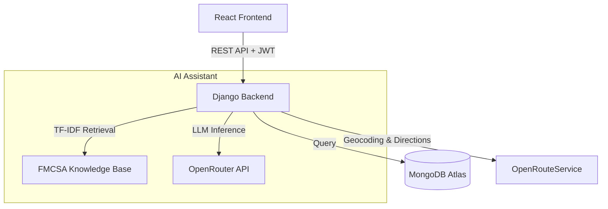
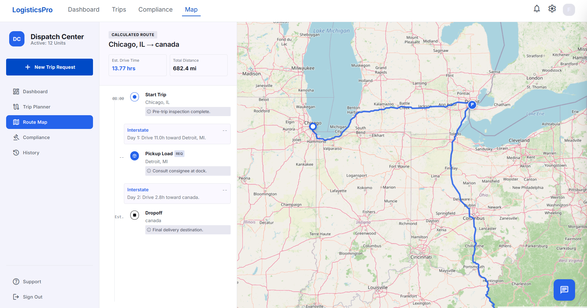
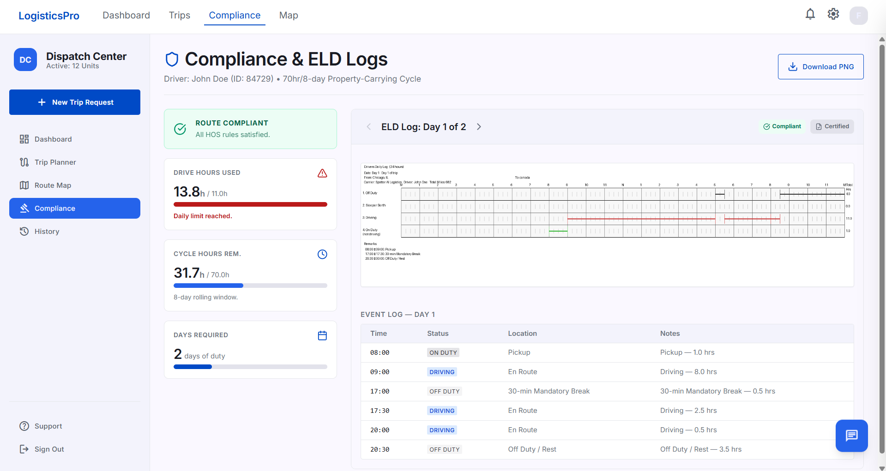
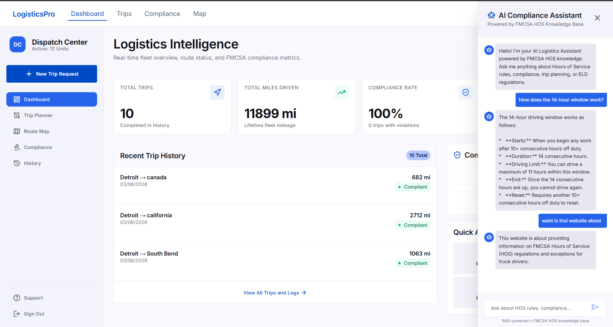

# LogisticsPro: AI-Powered ELD & Route Planning


> **Modern logistics intelligence tailored for fleet compliance and efficiency.**

LogisticsPro is a comprehensive web application designed for fleet managers and truck drivers. It uses advanced algorithms to calculate optimal routes, strictly enforces FMCSA Hours of Service (HOS) regulations, and automatically generates Electronic Logging Device (ELD) visual logs. An integrated RAG-powered AI Assistant acts as an instant compliance co-pilot, ready to answer complex regulatory questions based directly on FMCSA documentation.

## ✨ Key Features

- **Intelligent Route Planning**: Calculates exact mileage, drive times, and necessary fuel/rest stops.
- **HOS Compliance Engine**: Automatically checks trips against the 11-hour driving limit, 14-hour shift limit, and 30-minute break rule.
- **Automated ELD Logs**: Generates interactive visual log grids showing exactly when drivers should be Off Duty, Sleeper Berth, Driving, or On Duty.
- **RAG AI Assistant**: Features an embedded chatbot backed by OpenRouter LLMs and a custom TF-IDF Retrieval-Augmented Generation pipeline using FMCSA documentation.
- **Secure Authentication**: Custom JWT-based user authentication system with data fully isolated per user.
- **Cloud Database Integration**: Runs 100% on MongoDB Cloud (Atlas), making the application horizontally scalable without relational database bottlenecks.

---

## 🛠️ Tech Stack

### Frontend
- **Framework**: React 18 + Vite + TypeScript
- **Styling**: TailwindCSS (Modern, glassmorphic UI design)
- **State Management**: Zustand
- **Mapping**: React-Leaflet & OpenStreetMap
- **Icons**: Lucide React / Google Material Symbols

### Backend
- **Framework**: Django & Django REST Framework (DRF)
- **Database**: MongoDB Atlas
- **ORM**: MongoEngine
- **Authentication**: PyJWT & bcrypt
- **AI/RAG**: Scikit-Learn (TF-IDF), OpenRouter API
- **Routing Engine**: OpenRouteService API

---

## 🏗️ Architecture Diagram



---

## 🚀 Getting Started

### Prerequisites
- Node.js v18+
- Python 3.9+
- MongoDB Atlas cluster

### 1. Clone & Environment Setup
Clone the repository, then create `.env` files in both the root and `backend` directory:
```bash
# .env (and backend/.env)
MONGODB_URI="mongodb+srv://<username>:<password>@<cluster-url>/eld_db?retryWrites=true&w=majority"
OPENROUTESERVICE_API_KEY="your_ors_key"
OPENROUTER_API_KEY="your_openrouter_key"
```

### 2. Start the Backend
```bash
cd backend
python -m venv venv
source venv/bin/activate  # (or `venv\Scripts\activate` on Windows)
pip install -r requirements.txt
python manage.py runserver 8000
```

### 3. Start the Frontend
```bash
cd frontend
npm install
npm run dev
```

Visit `http://localhost:5173` to sign up and start planning routes!

---

## 📸 Screenshots

### 1. Route Planning & Map


### 2. Visual ELD Logs


### 3. AI Compliance Assistant

---

## 👨‍💻 Developed By
**Ahsan Yasin**

Feel free to connect on [LinkedIn](https://linkedin.com/) or explore my other projects on [GitHub](https://github.com/).